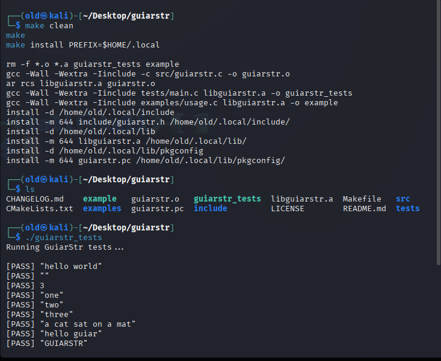

# GuiarStr

## Why GuiarStr?

GuiarStr helps C programmers handle strings more easily.

C has very basic string support. GuiarStr adds useful functions like trim, split, replace, lowercase, uppercase, prefix/suffix checks — all without external dependencies.

It’s lightweight, easy to use, and perfect for beginners, embedded systems, CLI tools, or any C project that needs better string handling.

---

## ✨ Features

- `guiarstr_trim` – Removes leading and trailing whitespace.
- `guiarstr_split` – Splits a string into parts based on a given delimiter.
- `guiarstr_replace` – Replaces all occurrences of a substring with another.
- `guiarstr_tolower` – Converts a string to lowercase (in-place).
- `guiarstr_toupper` – Converts a string to uppercase (in-place).
- `guiarstr_starts_with` – Checks if a string starts with a prefix.
- `guiarstr_ends_with` – Checks if a string ends with a suffix.
- `*_ignore_case` variants – Case-insensitive versions of prefix/suffix checks.

---

## 📦 Installation

### Option 1: Build locally

```bash
make            # Builds the static library (libguiarstr.a)
make test       # Builds and runs the test suite
make example    # Builds the usage demo

Option 2: Install to system or user path
make install PREFIX=$HOME/.local
This installs:

guiarstr.h to $PREFIX/include

libguiarstr.a to $PREFIX/lib

guiarstr.pc to $PREFIX/lib/pkgconfig for pkg-config integration

---------------------------------------------

🧪 Example Usage

#include <stdio.h>
#include "guiarstr.h"

int main() {
    char text[] = "  Hello World  ";
    printf("Trimmed: '%s'\n", guiarstr_trim(text));

    size_t count;
    char** parts = guiarstr_split("one,two,three", ',', &count);
    for (size_t i = 0; i < count; ++i) {
        printf("Part %zu: %s\n", i + 1, parts[i]);
    }
    guiarstr_split_free(parts, count);

    return 0;
}
🔧 Using with pkg-config

----------------------------------------------

gcc main.c $(pkg-config --cflags --libs guiarstr) -o app
Make sure PKG_CONFIG_PATH is set if you installed to a custom location:
export PKG_CONFIG_PATH=$HOME/.local/lib/pkgconfig

----------------------------------------------

📁 Project Structure
makefile

guiarstr/
├── include/        # Public header(s)
│   └── guiarstr.h
├── src/            # Implementation
│   └── guiarstr.c
├── tests/          # Unit tests
│   └── main.c
├── examples/       # Example programs
│   └── usage.c
├── guiarstr.pc     # pkg-config metadata
├── Makefile        # Makefile for building, testing, and install
├── README.md       # Project documentation
├── CHANGELOG.md    # Version history
└── LICENSE         # License information


## 🛠️ Build & Test

Here’s how the build and test process looks in the terminal:

<p align="center">
  
</p>


-----------------------------------------
                                      
📄 License
                                      
This project is licensed under the MIT License.
© GUIAR OQBA
See LICENSE for details.

-----------------------------------------

📫 Author
GUIAR OQBA
📧 Email: techokba@gmail.com
🌐 Website: https://okba14.github.io
📱 Phone: +2136-71-36-04-38

