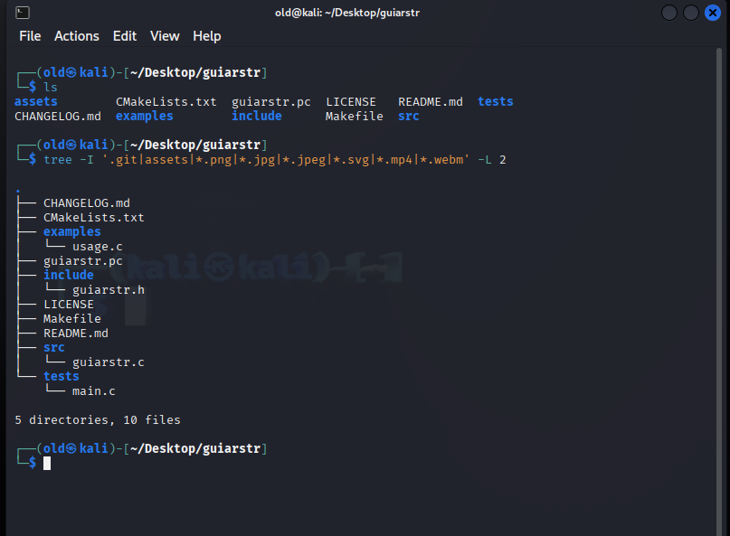
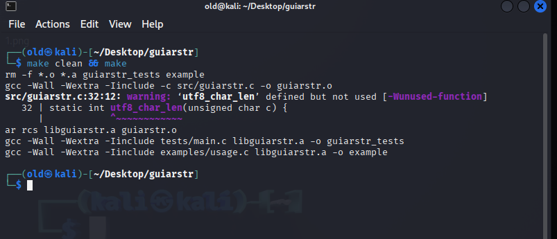
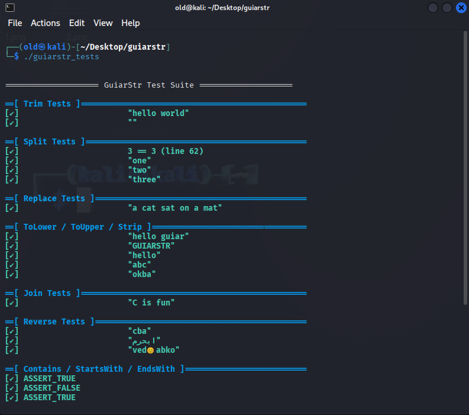
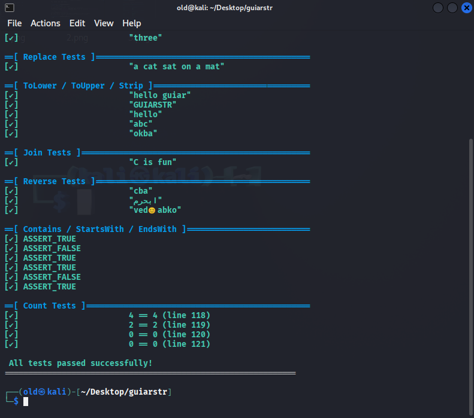

# GuiarStr

## Why GuiarStr?

GuiarStr helps C programmers handle strings more easily.

C has very basic string support. GuiarStr adds useful functions like trim, split, replace, lowercase, uppercase, reverse, containment checks — all without external dependencies.

It’s lightweight, easy to use, and perfect for beginners, embedded systems, CLI tools, or any C project that needs better string handling.

---

## ✨ Features

- `guiarstr_trim` – Removes leading and trailing whitespace.
- `guiarstr_split` – Splits a string into parts based on a given delimiter.
- `guiarstr_replace` – Replaces all occurrences of a substring with another.
- `guiarstr_tolower` / `guiarstr_toupper` – Converts a string to lowercase or uppercase (in-place).
- `guiarstr_starts_with` / `guiarstr_ends_with` – Checks if a string starts/ends with a prefix/suffix.
- `guiarstr_starts_with_ignore_case` / `guiarstr_ends_with_ignore_case` – Case-insensitive variants.
- `guiarstr_reverse` – Reverses a string (UTF-8 safe).
- `guiarstr_contains` – Checks if a string contains a substring.
- `guiarstr_count` – Counts occurrences of a substring.

---

## 🧠 UTF-8 Aware

- `guiarstr_reverse` is fully UTF-8 aware.
- Handles emojis and Arabic characters correctly.
- Ideal for multilingual or modern terminal-based applications.

---

## 📦 Installation

### Option 1: Build locally

```bash
make            # Builds the static library (libguiarstr.a)
make test       # Builds and runs the test suite
make example    # Builds the usage demo
Option 2: Install to system or user path
bash
Copy
Edit
make install PREFIX=$HOME/.local
This installs:

guiarstr.h to $PREFIX/include

libguiarstr.a to $PREFIX/lib

guiarstr.pc to $PREFIX/lib/pkgconfig for pkg-config integration

🧪 Example Usage


#include <stdio.h>
#include "guiarstr.h"

int main() {
    char text[] = "  Hello World  ";
    printf("Trimmed: '%s'\n", guiarstr_trim(text));

    size_t count;
    char** parts = guiarstr_split("one,two,three", ',', &count);
    for (size_t i = 0; i < count; ++i) {
        printf("Part %zu: %s\n", i + 1, parts[i]);
    }
    guiarstr_split_free(parts, count);

    char* reversed = guiarstr_reverse("okba😊dev");
    printf("Reversed: %s\n", reversed);
    free(reversed);

    return 0;
}
🔧 Using with pkg-config

gcc main.c $(pkg-config --cflags --libs guiarstr) -o app
💡 Make sure PKG_CONFIG_PATH is set if you installed to a custom location:


export PKG_CONFIG_PATH=$HOME/.local/lib/pkgconfig
📁 Project Structure


guiarstr/
├── include/        # Public header(s)
│   └── guiarstr.h
├── src/            # Implementation
│   └── guiarstr.c
├── tests/          # Unit tests
│   └── main.c
├── examples/       # Example programs
│   └── usage.c
├── assets/         # Screenshots or other assets
│   └── build_and_test.png
├── guiarstr.pc     # pkg-config metadata
├── Makefile        # Build/test/install automation
├── README.md       # This file
├── CHANGELOG.md    # Version history
└── LICENSE         # License info


🛠️ Build & Test Preview


| Step              | Screenshot                  |
|-------------------|-----------------------------|
| 🧱 Structure View |            |
| 🔨 Build          |            |
| ✅ Tests          |            |
| 🔁 UTF-8 Reverse  |            |


📄 License
This project is licensed under the MIT License.
© GUIAR OQBA
See LICENSE for details.
   
   
   
📫 Author
👤 Name: GUIAR OQBA
📧 Email: techokba@gmail.com
🌐 ORCID: https://orcid.org/0009-0008-1629-0002
💼 LinkedIn: https://www.linkedin.com/in/guiar-oqba-0207a9253/
💻 GitHub: https://github.com/okba14
📚 Zenodo: https://zenodo.org/records/15786076
📝 Hashnode: https://hashnode.com/@okba
✈️ Telegram: @okba_elkantara
📱 Phone: +2136-71-36-04-38


